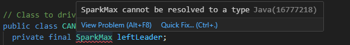
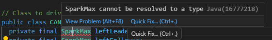
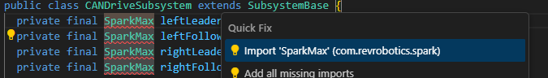

# Creating a Basic Driving Robot

<!-- TODO: Maybe split this into different pages -->

Lets get moving!


> [Picture source: Team 2984](http://ljrobotics.org/games/power-up-2018/){target=_blank}

## Overview

This section is designed to help you program a basic driving robot, start to finish.

**See table of contents for a breakdown of this section.**

***

## Creating the Drivetrain Subsystem

Before we begin we must create the class file for the drivetrain subsystem. See [Creating a New Subsystem](new_project.md#creating-a-new-subsystem){target=_blank} for info on how to do this.

### What will be added to the Drivetrain

In the Drivetrain class we will tell the subsystem what type of components it will be using.

- A Drivetrain needs motor controllers. In our case we will use Neo SparkMaxes (a brand of controller for motors made by Rev Robotics).
    - You could use other motor controllers such as Victor SPs or Talon SRs but we will be using NEO SparkMaxes
      - If you are using other motor controllers, replace SparkMax with Talon, TalonSRX, Victor, or VictorSP in the code you write depending on the type you use.
    - You can use 2 motors (left and right), but for this tutorial we will use 4.

!!! note "More Info"
    Be sure to read [Visual Studio Code Tips](../basics/vscode_tips.md){target=_blank} before getting started! It will make your life a lot easier.

### Creating the SparkMax Variables


**1)** Create 4 global variables of data type **SparkMax** and name them: `leftLeader`, `rightLeader`, `leftFollower`, `rightFollower`

- To get started type the word SparkMax followed by the name i.e. `private final SparkMax leftLeader;`
- These will eventually hold the object values for SparkMaxes, their port numbers, and their motor type (brushed or brushless).

!!! note "Java concept: `private final` fields"
    `private` means only this class can access this variable — no other subsystem or command can accidentally change your motor objects. `final` means the variable is assigned once (in the constructor) and never reassigned. Together they say "this motor belongs exclusively to this subsystem." See [Variables and Data Types](../basics/java_types_variables.md#constants) for more on `final` and [Classes](../basics/java_classes.md#fields) for more on `private`.


**2)** These are declared without values right now.

- We do this to make sure it is empty at this point.
- When we assign these variables a value, we will be getting the motor controller's port numbers out of Constants
    - This means we cannot assign them at the global level


??? example "Example code"
    **SparkMax Motor Member Variables:**

    ```java title="CANDriveSubsystem.java"
    --8<-- "docs/code_examples/2026KitBotInline/subsystems/CANDriveSubsystem.java:motors"
    ```

!!! note "Using a different motor controller?"
    The steps in this section use `SparkMax`, but the pattern is the same for other controllers. Replace `SparkMax` with your controller type (e.g. `TalonFX`, `VictorSP`) and use the corresponding import. Constructor parameters and configuration APIs differ by vendor — consult your vendor's documentation or WPILib's [hardware API guide](https://docs.wpilib.org/en/stable/docs/software/hardware-apis/motors/index.html){target=_blank} for the correct syntax.

**If an error occurs (red squiggles)**

1. Mouse Over the word SparkMax: The following menu should appear.


2. 💡 Click "quick fix" 


3. Select "Import 'SparkMax' (com.revrobotics.spark)"


4. Your error should be gone!

### Creating and filling the constructor

Now that we have created the SparkMaxes  and the Drive Constants we must initialize them and tell them what port on the roboRIO they are on.

**1)** Initialize (set value of) `leftLeader` to `new SparkMax(LEFT_LEADER_ID, MotorType.kBrushless)`. 

- This initializes a new SparkMax, `leftLeader`, in a new piece of memory and states it is on the port defined by `LEFT_LEADER_ID`. 
- This should be done within the constructor `Drivetrain()`

!!! note "Java concept: Constructor"
    The constructor is a special method that runs once when an object is created with `new`. It is where hardware gets initialized — motors receive their port numbers, controllers get configured. The constructor name always matches the class name exactly. See [Java Classes](../basics/java_classes.md#constructors).

- This calls the constructor `SparkMax(int, MotorType)` in the SparkMax class. 
    - The constructor `SparkMax(int, MotorType)` takes a variable of type `int` for the CAN ID and `MotorType` for brushless or brushed. In this case the `int` (integer) refers to the CAN ID on the roboRIO. 
    
 **roboRIO port diagram**


??? example "Constructor Initialization Example"
    ```java title="Drivetrain.java - Constructor Declaration"
    public CANDriveSubSystem () {}
    ```

    **Full Constructor: **

    ```java title="Full Constructor"
    --8<-- "docs/code_examples/2026KitBotInline/subsystems/CANDriveSubsystem.java:constructor"
    ```

    See [CANDriveSubsystem.java](../code_examples/2026KitBotInline/subsystems/CANDriveSubsystem.java) for the complete constructor implementation.

### Using Constants

!!! note
    `Constants.java` fills the same role that older WPILib projects called `RobotMap.java` — a single file mapping every physical port to a named constant. If you see references to `RobotMap` in older FRC code examples, treat them the same as `Constants`.

Since each subsystem has its own components with their own ports, it is easy to lose track of which ports are being used and for what. To counter this you can use a class called **Constants** to hold all these values in a single location.

- Names should follow the pattern SUBSYSTEM_NAME_OF_COMPONENT
- The name is all caps since it is a **constant** ([more info on constants](../basics/java_types_variables.md#constants){target=_blank}).


Before we initalize the SparkMax objects we are going to create constants to hold the CAN ID's of the motors. This will happen in constants.java

- Inside the constants class, create a new class called `public static DriveConstants`.
- Inside `DriveConstants` class, create for constants called `LEFT_LEADER_ID`, `LEFT_FOLLOWER_ID`, `RIGHT_LEADER_ID`, and `RIGHT_FOLLOWER_ID`.
- Back in your `DriveTrain` class in `drivetrain.java`, import the `DriveConstants` class as follows: `Import frc.robot.Constants.DriveConstants;`.

!!! tip
    Make sure to declare constants with `public static final` so they cannot be changed at runtime.

!!! danger
    If you set this to the wrong value, you could damage your robot when it tries to move!
!!! note
    To use Constants, instead of putting `0` for the port in the SparkMax type:

    ```java title="Constants.java - Drive Constants"
    public static final int LEFT_LEADER_ID = 1;
    ```

!!! note
    Replace the remaining numbers with constants.

!!! tip
    Remember to save both **Drivetrain.java** and **Constants.java**

??? example "DriveConstants Example"
    **Drive Constants Definition:**

    ```java title="Constants.java - Drive Constants Definition"
    --8<-- "docs/code_examples/2026KitBotInline/Constants.java:constants"
    ```

**Full Constants.java with all Robot Constants:**

See [Constants.java](../code_examples/2026KitBotInline/Constants.java) for the complete constants file including OperatorConstants and other subsystem constants.

!!! warning
    Remember to use the values for **YOUR** specific robot or you could risk damaging it!

### Configuring the SparkMaxes

**Setting CAN Timeout:**

Each SparkMax motor must be configured with a CANTimeout. (How long to wait for a response from the motor controller)

```java title="CANDriveSubsystem.java"
--8<-- "docs/code_examples/2026KitBotInline/subsystems/CANDriveSubsystem.java:can-timeout"
```

**Voltage Compensation and Current Limiting:**

Create the configuration to apply to motors. Voltage compensation helps the robot perform more similarly on different battery voltages (at the cost of a little bit of top speed on a fully charged battery). The current limit helps prevent tripping breakers.

```java title="CANDriveSubsystem.java"
--8<-- "docs/code_examples/2026KitBotInline/subsystems/CANDriveSubsystem.java:voltage-compensation"
```

See [CANDriveSubsystem.java](../code_examples/2026KitBotInline/subsystems/CANDriveSubsystem.java) for the full configuration implementation in the constructor.

## Creating the arcade drive

### What is the Drive Class

- The FIRST Drive class has many pre-configured methods available to us including DifferentialDrive, and many alterations of MecanumDrive.
- DifferentialDrive contains subsections such as TankDrive and ArcadeDrive.
    For more information and details on drive bases see the [WPILib documentation](https://docs.wpilib.org/en/stable/docs/software/hardware-apis/motors/wpi-drive-classes.html){target=_blank}.
- For our tutorial we will be creating an ArcadeDrive
- Arcade drives run by taking a moveSpeed and rotateSpeed. moveSpeed defines the forward and reverse speed and rotateSpeed defines the turning left and right speed.
- To create an arcade drive we will be using our already existing Drivetrain class and adding to it.

### Programing a RobotDrive

<!-- TODO: Add instructions for TalonSRX -->

**1)** Create the DifferentialDrive object.

**Member Variable Declaration:**
```java title="CANDriveSubsystem.java - Differential Drive Variable"
--8<-- "docs/code_examples/2026KitBotInline/subsystems/CANDriveSubsystem.java:differential-drive-variable"
```
This defines the drive object that we will use to drive the robot.

**Constructor Initialization:**
```java title="CANDriveSubsystem.java - Drive Initialization"
drive = new DifferentialDrive(leftLeader, rightLeader);
```
This initializes the differential drive object with the left and right leader motors.

- Since DifferentialDrive takes 2 parameters we pass the left and right leader motors.
- The follower motors are configured to follow these leaders through the SparkMax configuration.

!!! warning
    You should only group motors that are spinning the same direction physically when positive power is being applied otherwise you could damage your robot.

**2)** In order to configure the motors to drive correctly, we need to configure one on each side as the leader and one as the follower.
In the constructor we are going to set the follower motors and link them to the leader motors. To do this we will need to include a couple more classes from the REV Library:
```java title="CANDriveSubsystem.java - Required Imports"
import com.revrobotics.spark.SparkBase.PersistMode;
import com.revrobotics.spark.SparkBase.ResetMode;
```
Then in the constructor, configure the followers to follow the leaders:

**Set follower configuration:**
```java title="CANDriveSubsystem.java - Follower Configuration"
--8<-- "docs/code_examples/2026KitBotInline/subsystems/CANDriveSubsystem.java:follower-config"
```

**Configure right leader:**
```java title="CANDriveSubsystem.java - Right Leader Configuration"
--8<-- "docs/code_examples/2026KitBotInline/subsystems/CANDriveSubsystem.java:right-leader-config"
```

**Invert left leader for correct motor direction:**
```java title="CANDriveSubsystem.java - Left Leader Inversion"
--8<-- "docs/code_examples/2026KitBotInline/subsystems/CANDriveSubsystem.java:left-inversion"
```

??? example "Full Drive Subsystem Example"
    See [CANDriveSubsystem.java](../code_examples/2026KitBotInline/subsystems/CANDriveSubsystem.java) for the complete implementation with all motor configuration and initialization.

### Creating the driveArcade Command Factory

Instead of writing a separate command class, we use the **command factory pattern** — a method on the subsystem that returns a `Command`. This is the modern WPILib approach and keeps drive logic inside `CANDriveSubsystem` where it belongs. See [Command Based Robot](../basics/wpilib.md#command-based-robot){target=_blank} for background on commands.

!!! abstract
    Below the `periodic` method, add the `driveArcade` factory method:

    ```java title=”CANDriveSubsystem.java”
    --8<-- “docs/code_examples/2026KitBotInline/subsystems/CANDriveSubsystem.java:drive-arcade-method”
    ```

    - `this.run(...)` creates a command that calls the lambda repeatedly while scheduled. The subsystem is automatically added as a requirement.  
    - The parameters are `DoubleSupplier` (a function that returns a `double`) rather than plain `double` values. This ensures the joystick reading is evaluated every loop cycle instead of being captured once. this is important to ensure the robot continuously responds to joystick movement.
    - `drive.arcadeDrive(...)` is the WPILib `DifferentialDrive` call that physically moves the motors.

!!! note
    To use tank drive instead, replace `drive.arcadeDrive(...)` with `drive.tankDrive(...)` and rename the method accordingly.

    !!! tip
        Multiply the speed values by a decimal to cap the max speed during initial testing (e.g. `xSpeed.getAsDouble() * 0.5`). This makes it easier to verify the robot drives in the correct directions before running at full power/speed.

## Wiring Up in RobotContainer

Now we connect the subsystem to the driver’s controller by setting a default command in `RobotContainer.java`.

### Adding the Driver Controller

The `RobotContainer` class holds all subsystems, controllers, and command bindings. A `CommandXboxController` is declared here and reads joystick input.

!!! note
    **1)** Open `Constants.java` and confirm the `DRIVER_CONTROLLER_PORT` constant is present inside `OperatorConstants`.

    **2)** Open `RobotContainer.java` and confirm a `CommandXboxController driverController` field is declared at the top of the class that uses that constant.

!!! tip “Finding your joystick port in the Driver Station”
    Open the **Driver Station** application and click the **USB** tab (the plug icon on the left). The number next to your controller is its port — use that value for `DRIVER_CONTROLLER_PORT` in Constants. Controllers can be dragged in the list to change their assigned port (the controller port is usually 0 by default if only one controller is plugged in).

### Using setDefaultCommand

`setDefaultCommand` tells a subsystem which command to run whenever no other command is using it. Since we always want the driver to be able to move the robot, the drive factory command is set as the default.

!!! abstract
    Inside `configureBindings()` in `RobotContainer.java`, add:

    ```java title=”RobotContainer.java”
    --8<-- “docs/code_examples/2026KitBotInline/RobotContainer.java:drive-config”
    ```

    - The Y axis is negated so pushing the stick away from you (a negative joystick value) drives the robot forward (positive motor output).
    - The X axis is negated to match WPILib’s counter-clockwise-positive rotation convention.
    - Both axes are scaled by constants defined in `OperatorConstants` to make the robot easier to control at full stick deflection.

    !!! tip
        The `()->` syntax creates a **lambda** — an anonymous function. [More about Lambdas](https://www.w3schools.com/java/java_lambda.asp){target=_blank}

        Lambdas are required here because `driveArcade` expects `DoubleSupplier` parameters. A lambda `() -> driverController.getLeftY()` is a `DoubleSupplier` — it gets called every loop cycle so the robot continuously responds to joystick movement.

??? example “Full RobotContainer Example”
    See [RobotContainer.java](../code_examples/2026KitBotInline/RobotContainer.java) for the complete `RobotContainer` implementation.