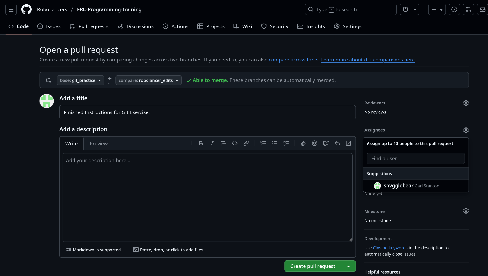

# Git Workflow

## Branches

Branches are a deviation or split from the main branch that can be adding or removing a specific feature
For example, I can open a branch to work on a new doc page for this training repo.
Since I am on my own branch, I am not interfering with the main branch's commit history, which is supposed to be kept clean.
A "clean" commit history is made up of large, well named commits to make it easy to quickly skim recent changes.
Because I am on my own branch, another student can also work on their own article without fear of interfering with my work.

To create a branch run:
`git checkout -b "<branch name>"`

Then, this new branch works just like the main branch with `pull`, `add`, `commit`, and `push` commands.
You should see your current branch in blue in the command prompt if you are using git bash.
Otherwise you can use `git status` to check your branch.

Right now, this branch is only local to your computer.
To upload (push) this branch to the remote repository so others can view it, run `git push`.
The first time you push a branch, git will prompt you to instead run `git push --set-upstream origin <branch name>`.
Replace `<branch name>` with the name of your branch.
Now, it should show up on GitHub and be accessible by others.
Use `git push` without the rest to push any further commits.

## Pull Requests

Pull requests (PRs) are crucial to write maintainable, clean code.
A pull request is a way to get a review from others on changes before merging them to the main branch.
To ensure that we always have working and tested code on main, pull requests are required to merge code into main on our season repositories.

To make a pull request, first you need to have changes to merge.
These changes should be on their own, well named branch.
Then go to the pull requests tab on the Github repo and hit `new pull request`.
You should be prompted to compare a branch with main.
Select the branch you want to merge.
You should see a list of changes and a green button that says `Create pull request`.
Click that button, then let a software lead or mentor know that you need review and request them in Github.

## Issues

Issues are a way to track features that we want to add and problems we need to fix in the repository.
Issues can be created by going to the issues tab of the repository on Github and clicking `New issue`.
If there is a relevant issue for something you are working on, make sure to keep it up to date!
If you have something that you think should be added or fixed, open an issue!

## Github Projects

>The Robolancers programming team uses Github Projects to manage projects and delegate tasks.
You can access the Project for each repository in its own tab at the top, and add tasks organized by the status columns.

Tasks that are explicitly about a specific PR should be converted to an issue and linked to that PR.
This will automatically resolve the issue when the PR is merged and move the task to the Completed column.
Important milestones (handoff day, our first competition), major features (add preliminary autos, add intake subsystem), and bugfixes/improvements (improve vision filtering, fix multi-piece auto) should all go in the Project.
Leads/Mentors are expected to add these kinds of major deadlines as soon as they're coordinated, and monitor subteam member progress frequently.

During the commotion of the build season, it is very easy to lose track of what needs to be done, who is supposed to be doing it, and when it needs to be done, and so it doesn't get done.
Hence, **it is expected** that you regularly **enter** events, task assignments, and deadlines so this can accurately reflect what we're working on.
It is also expected that you regularly **check** what has been assigned to you.
If you feel unsure of what you need to do, ask a lead/mentor ASAP!


### **🎯 Simplified Git Flow for RoboLancers**

Git Flow is like having different workbenches in your robotics shop, each with a specific purpose:

#### 🟣 Your Personal Branch - "Your Workbench”

- When you want to add a feature or fix a bug, create a branch with YOUR name or the task
- Examples: `mar-liu/fix-intake` or `add-autonomous-mode`
- When ready, you create a **Pull Request** to merge into main

#### **🔷 Release Branch (Optional - mainly for competitions)**

- Created right before a big competition
- Used for final testing and bug fixes only
- Like doing final checks before loading the robot on the trailer

#### **🟠 Hotfix Branch - "Emergency Repairs"**

- For critical bugs found during competition
- Quick fix that goes straight to main after review
- Like realizing a motor is backwards 5 minutes before a match

#### Resources

- [Github creating a PR](https://docs.github.com/en/pull-requests/collaborating-with-pull-requests/proposing-changes-to-your-work-with-pull-requests/creating-a-pull-request)
- [Github about PRs](https://docs.github.com/en/pull-requests/collaborating-with-pull-requests/proposing-changes-to-your-work-with-pull-requests/about-pull-requests?platform=windows)
- [Github about issues](https://docs.github.com/en/issues/tracking-your-work-with-issues/about-issues)
- [Github linking a PR to an issue](https://docs.github.com/en/issues/tracking-your-work-with-issues/linking-a-pull-request-to-an-issue)

#### Examples

- [A video demonstrating the exercise](../assets/images/git/PRDemoVideo.mkv)


### Exercises

- Simple commit
  - Clone this repository from Github
  - Create a branch from ```main``` with the following name: ```[your_name]_git_practice```
  - Add your name to the list at the bottom of this file
  - Commit and push those changes
- Merging changes
  - Pull the ```git_practice``` branch into your branch (either with the command line or the GUI)
  - Push the merged changes to your branch.
  - Create pull request back into ```git_practice``` branch. Add Carl as a reviewer.

#### Where to create a pull request

- Select the pull request tab on the repository page on Github
- Select "Create new pull request"
- choose ```git_practice``` as the base branch, and your branch as the compare branch.
- Click "create pull request"
- Select the gear next to assignees on the right side
- Add Carl Stanton ```@snvgglebear``` as a reviewer.
- Select "create pull request" again



### Name
